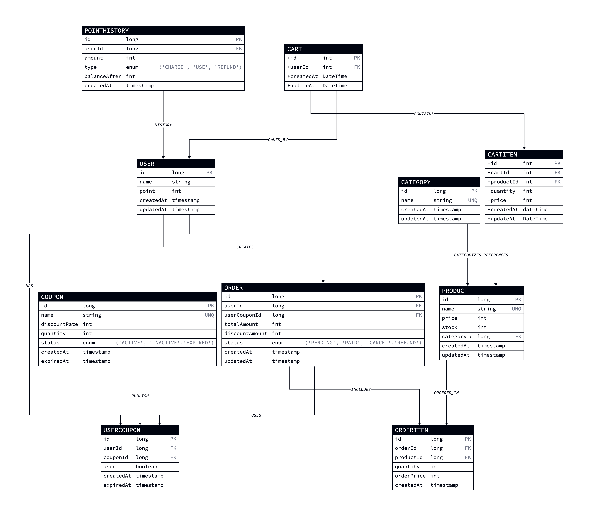

# 0. 마일스톤

- ### [마일스톤 바로가기](https://github.com/sabsiru/hanghe-eCommerce/milestones)

---
# 1. 요구사항 분석

- ### [요구사항 분석 바로가기](docs/Requirements.md)

---
# 2. ERD 설계
<details>
<summary>보기</summary>
    
</details>

---


## 프로젝트

## Getting Started

### Prerequisites

#### Running Docker Containers

`local` profile 로 실행하기 위하여 인프라가 설정되어 있는 Docker 컨테이너를 실행해주셔야 합니다.

```bash
docker-compose up -d
```# hanghe-eCommerce
