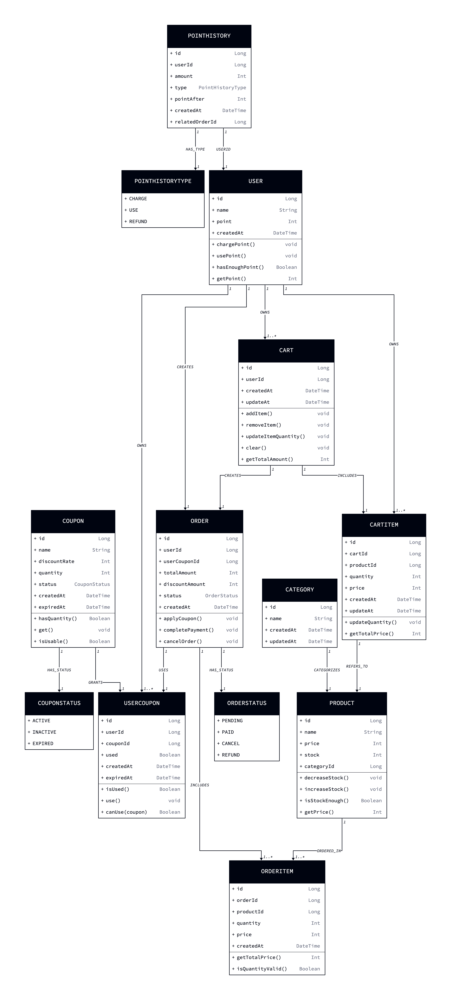
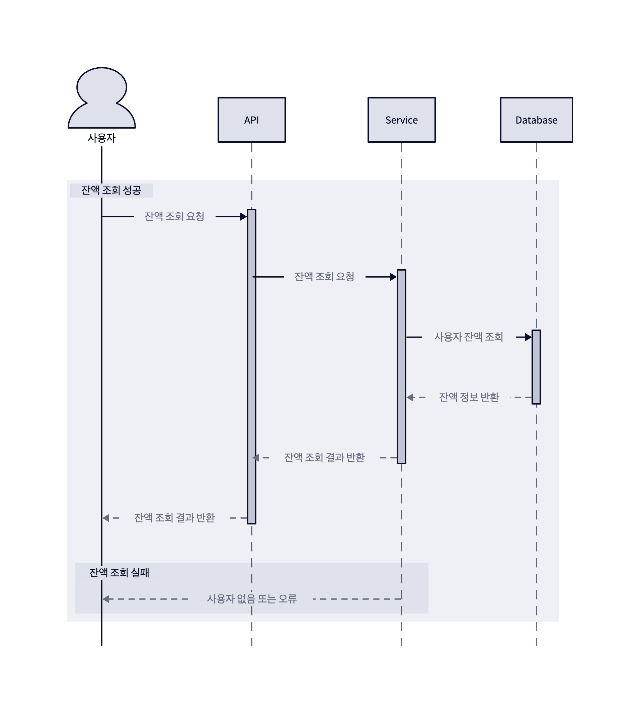
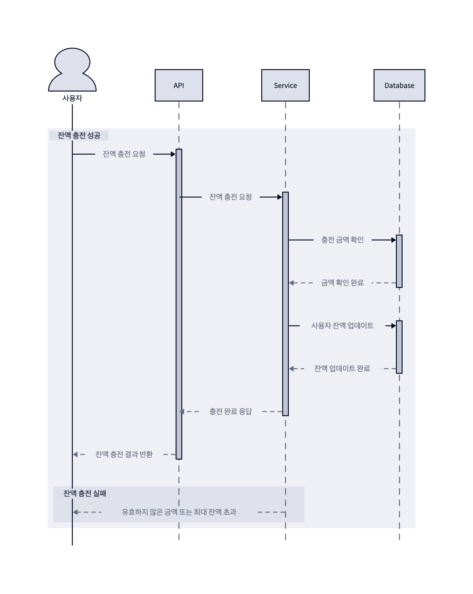
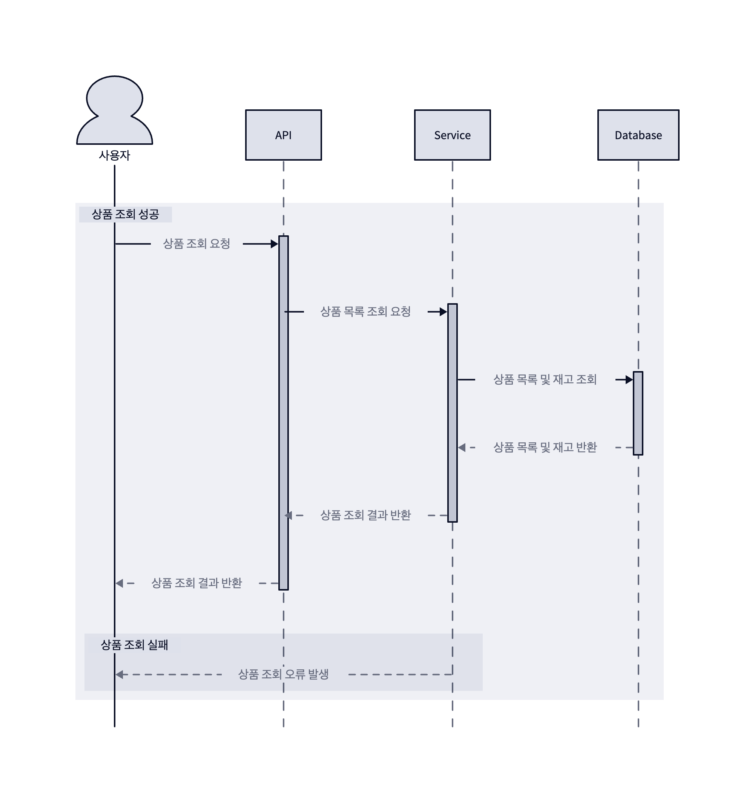
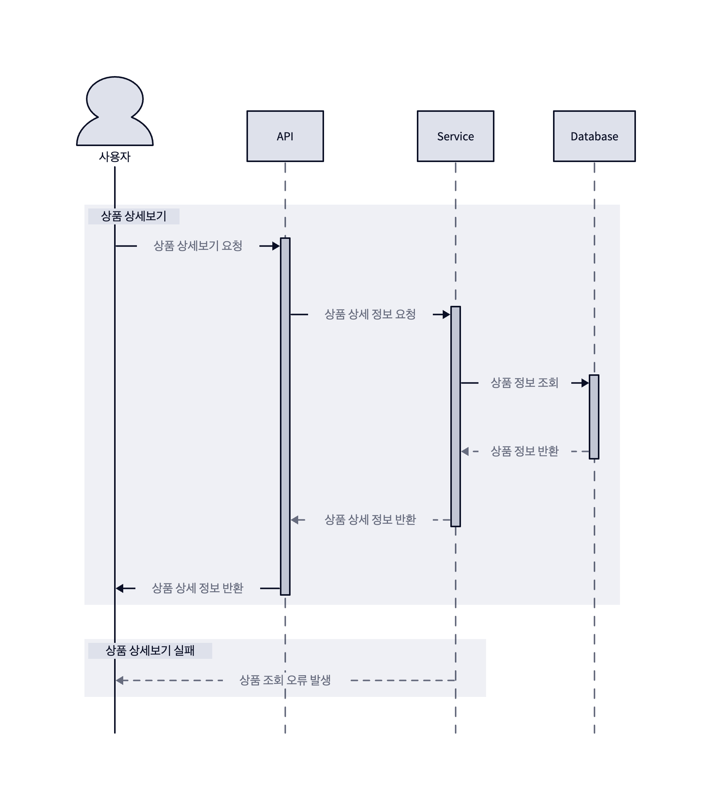
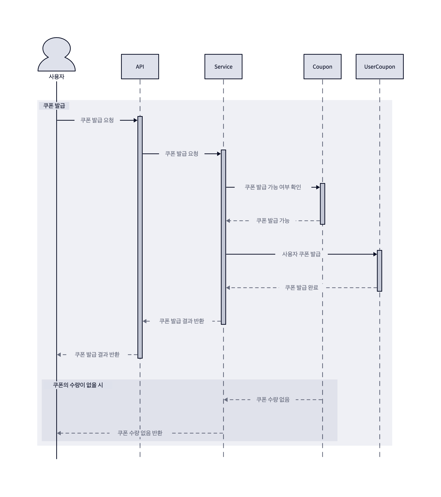
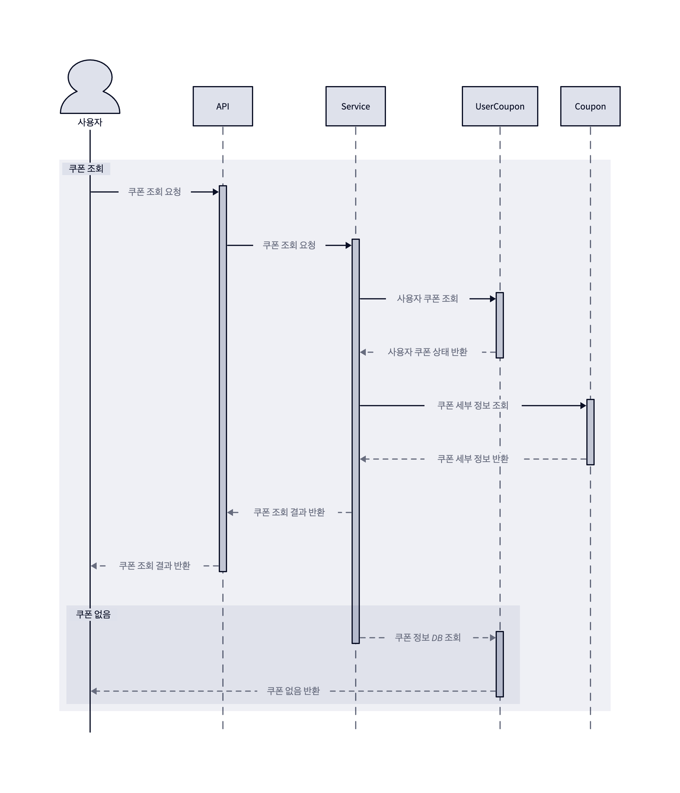
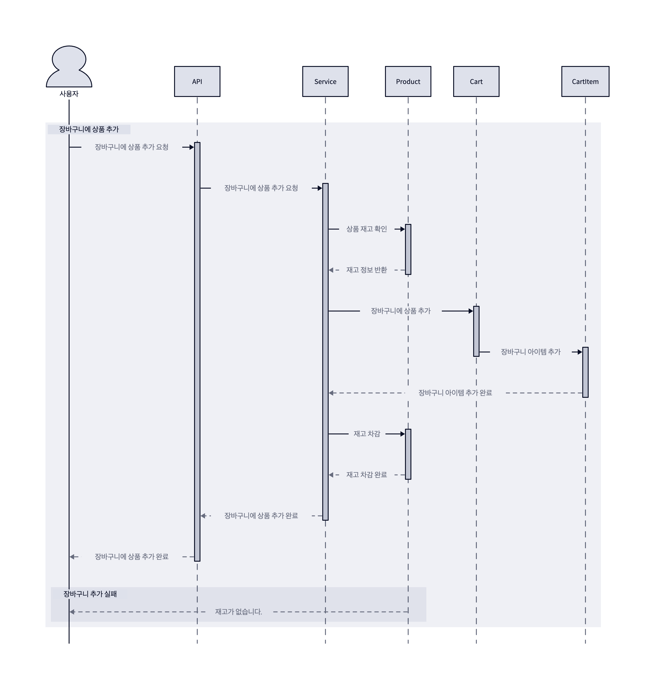
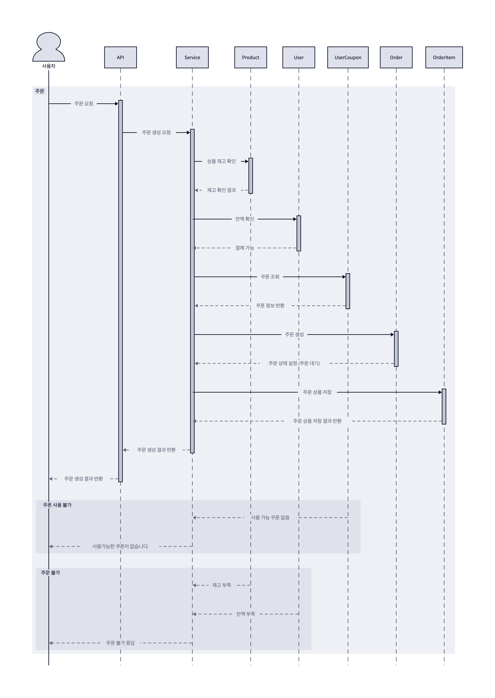
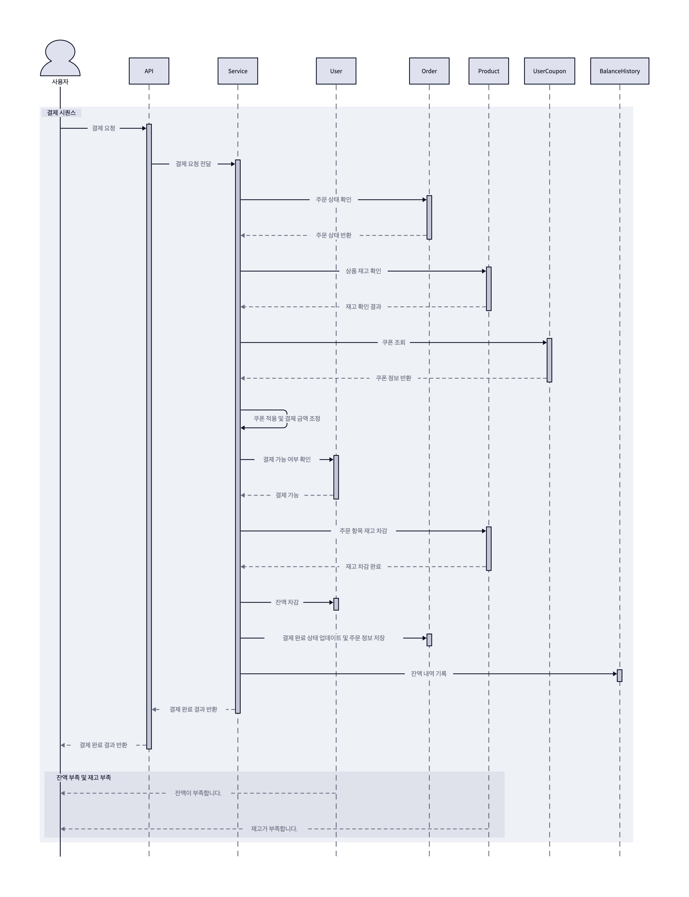

# 0. 마일스톤

- ### [마일스톤 바로가기](https://github.com/sabsiru/hanghe-eCommerce/milestones)

---
# 1. 요구사항 분석

- ### [요구사항 분석 바로가기](docs/Requirements.md)

---
# 2. ERD 설계
<details>
<summary>보기</summary>
    
</details>

---
# 3. 클래스 다이어그램 설계
<details>
<summary>보기</summary>
    
</details>

---
# 4. 시퀀스 다이어그램

### 잔액 조회
<details>
<summary>보기</summary>
    
</details>

### 잔액 충전
<details>
<summary>보기</summary>
    
</details>

### 상품 조회
<details>
<summary>보기</summary>
    
</details>

### 상품 상세보기
<details>
<summary>보기</summary>
    
</details>

### 상위 상품 조회
<details>
<summary>보기</summary>
    
</details>

### 쿠폰 발급
<details>
<summary>보기</summary>
    
</details>

### 쿠폰 조회
<details>
<summary>보기</summary>
    
</details>

### 장바구니 추가
<details>
<summary>보기</summary>
    
</details>

### 주문
<details>
<summary>보기</summary>
    
</details>

### 결제
<details>
<summary>보기</summary>
    
</details>

---
# 5. API 명세서

- ### [잔액 조회](docs/api/get-balance.md)
- ### [잔액 충전](docs/api/charge-balance.md)
- ### [상품 조회](docs/api/list-products.md)
- ### [상품 상세보기](docs/api/get-product.md)
- ### [장바구니 추가](docs/api/add-cart.md)
- ### [상위 상품 조회](docs/api/popular-products.md)
- ### [쿠폰 발급](docs/api/issue-coupon.md)
- ### [쿠폰 사용](docs/api/use-coupon.md)
- ### [주문](docs/api/order.md)
- ### [결제](docs/api/payments.md)

---

## 프로젝트

## Getting Started

### Prerequisites

#### Running Docker Containers

`local` profile 로 실행하기 위하여 인프라가 설정되어 있는 Docker 컨테이너를 실행해주셔야 합니다.

```bash
docker-compose up -d
```# hanghe-eCommerce
