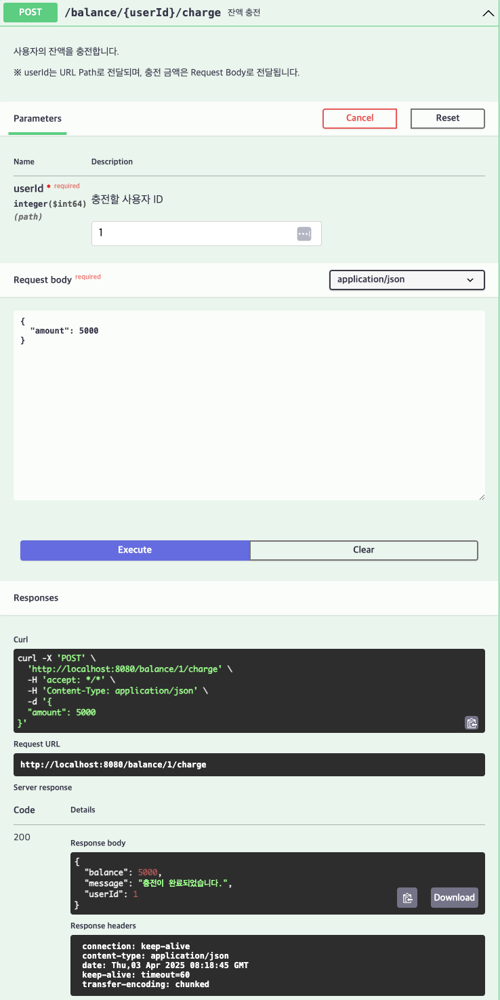

# [POST] /balance/{userId}/charge

## Path Variable

| 이름     | 타입   | 설명       |
|----------|--------|------------|
| userId   | Long   | 사용자 ID |

## Request Body

```json
{
  "amount": 5000
}
```
## Response Body
```
{
  "userId": 1,
  "balance": 5000,
  "message": "충전이 완료되었습니다."
}
```

## Swagger UI



[돌아가기](../../README.md)