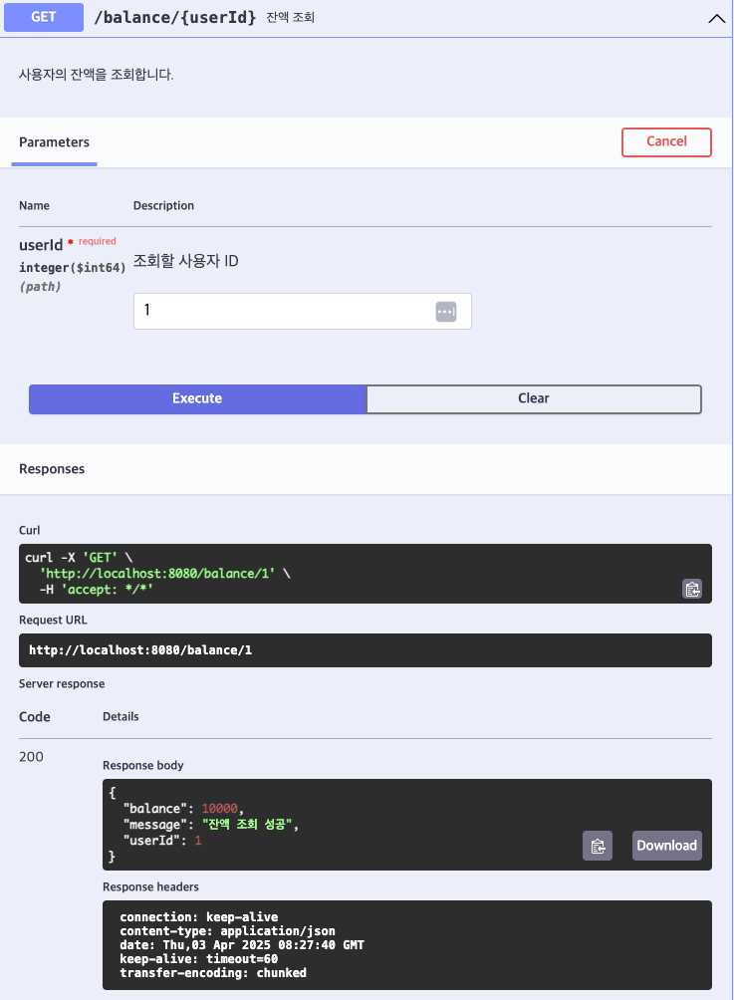

# [GET] /balance/{userId}

## Path Variable

| 이름   | 타입 | 설명       |
|--------|------|------------|
| userId | Long | 사용자 ID |

## Response Body
```
{
"userId": 1,
"balance": 10000,
"message": "잔액 조회 성공"
}
```
## Swagger UI



[돌아가기](../../README.md)