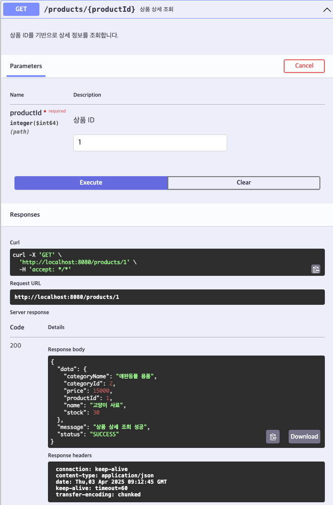

# [GET] /products/{productId}

## Path Variable

| 이름       | 타입   | 설명     |
|------------|--------|----------|
| productId  | Long   | 조회할 상품 ID |

## Response Body
```
{
"productId": 1,
"name": "고양이 사료",
"price": 15000,
"stock": 30,
"categoryId": 2,
"categoryName": "애완동물 용품"
}
```
## Swagger UI



[돌아가기](../../README.md)