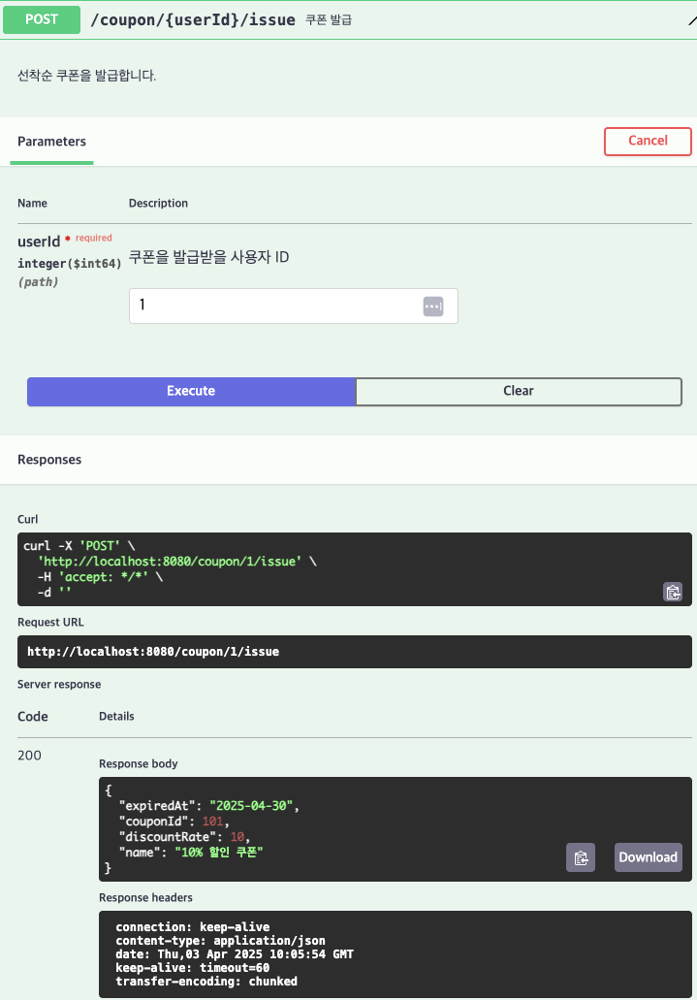

# [POST] /coupon/{userId}/issue

## 설명
해당 사용자에게 선착순으로 쿠폰을 발급합니다.

## Path Variable

| 이름     | 타입   | 설명             |
|----------|--------|------------------|
| userId   | Long   | 쿠폰 발급 대상 사용자 ID |

## Response Body
```
{
"couponId": 101,
"name": "10% 할인 쿠폰",
"discountRate": 10,
"expiredAt": "2025-04-30"
}
```
## Swagger UI



[돌아가기](../../README.md)