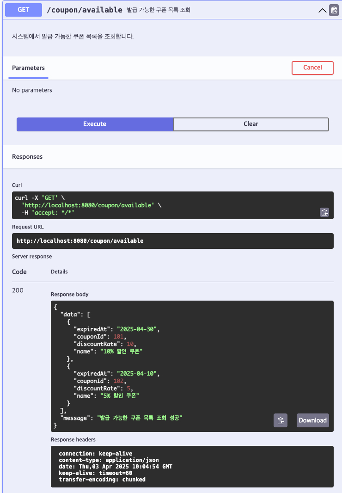

# [GET] /coupon/available

## 설명

시스템에서 발급 가능한 쿠폰 목록을 조회합니다.

## Response Body

```
{
"data": [
{
"couponId": 101,
"name": "10% 할인 쿠폰",
"discountRate": 10,
"expiresAt": "2025-04-30"
},
{
"couponId": 102,
"name": "5% 할인 쿠폰",
"discountRate": 5,
"expiresAt": "2025-04-10"
}
]
}
```

## Swagger UI



[돌아가기](../../README.md)