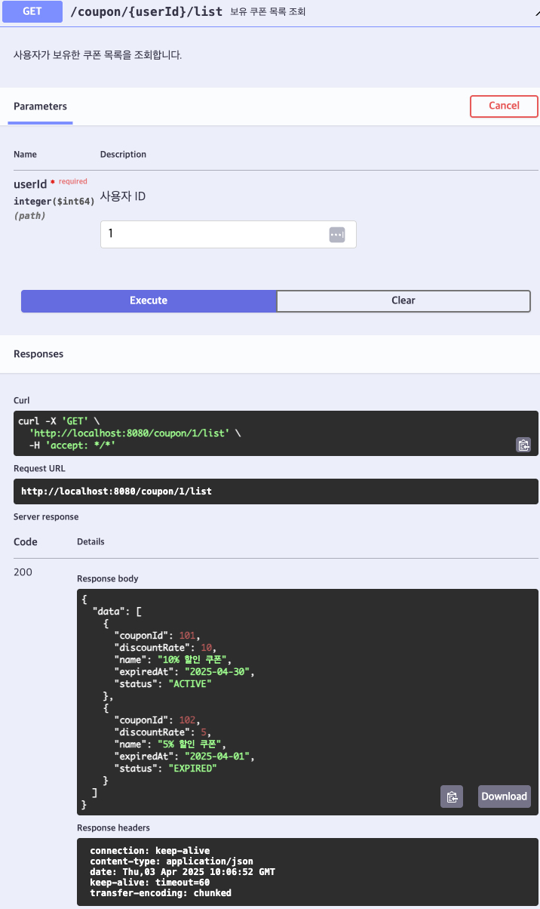

# [GET] /coupon/{userId}/list

## 설명

사용자가 보유한 쿠폰 목록을 조회합니다.

## Path Variable

| 이름     | 타입   | 설명     |
|--------|------|--------|
| userId | Long | 사용자 ID |

## Response Body

```
{
"status": "SUCCESS",
"data": [
        {
        "couponId": 101,
        "name": "10% 할인 쿠폰",
        "discountRate": 10,
        "expiresAt": "2025-04-30",
        "couponStatus": "ACTIVE"
        },
        {
        "couponId": 102,
        "name": "5% 할인 쿠폰",
        "discountRate": 5,
        "expiresAt": "2025-04-01",
        "couponStatus": "EXPIRED"
        }
    ]
}
```

## Swagger UI



[돌아가기](../../README.md)