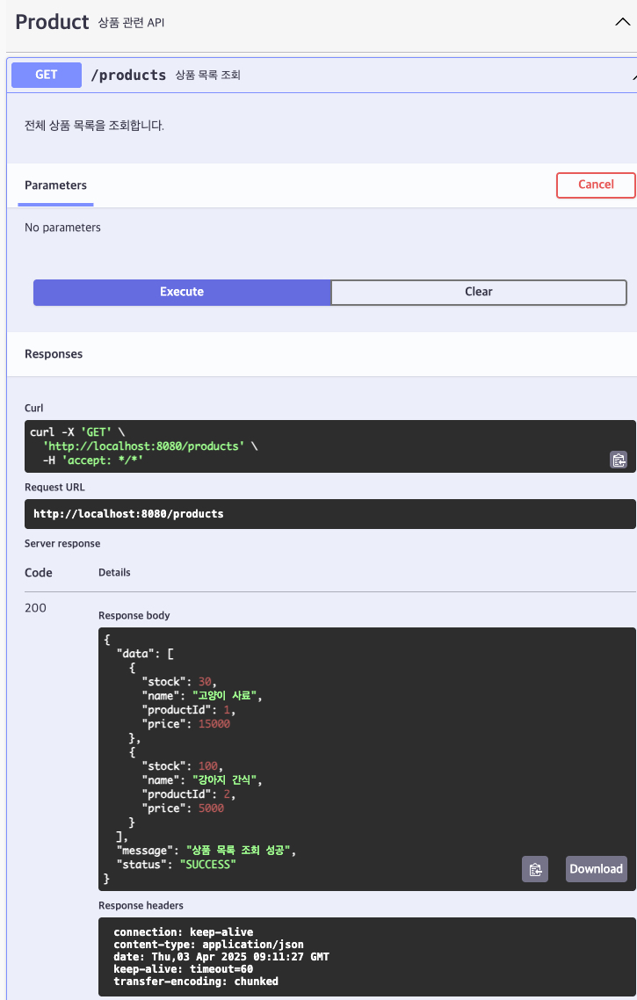

# [GET] /products

## 설명
전체 상품 목록을 조회합니다.

## Response Body

```
{
  "data": [
    {
      "productId": 1,
      "name": "고양이 사료",
      "price": 15000,
      "stock": 30
    },
    {
      "productId": 2,
      "name": "강아지 간식",
      "price": 5000,
      "stock": 100
    }
  ],
  "message": "상품 목록 조회 성공"
}
```
## Swagger UI



[돌아가기](../../README.md)