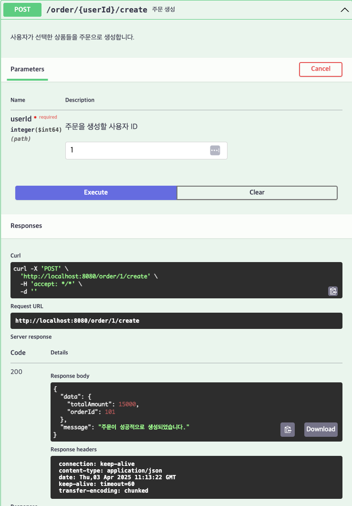

# [POST] /order/{userId}/create

## 설명
사용자가 선택한 상품들을 주문으로 생성합니다.

## Path Variable

| 이름     | 타입   | 설명         |
|----------|--------|--------------|
| userId   | Long   | 주문을 생성할 사용자 ID |

## Request Body
```
{
"items": [
{
"productId": 1,
"quantity": 2
},
{
"productId": 3,
"quantity": 1
}
]
}

## Response Body

{
"status": "SUCCESS",
"data": {
"orderId": 101,
"totalAmount": 15000
},
"message": "주문이 성공적으로 생성되었습니다."
}
```
## Swagger UI



[돌아가기](../../README.md)