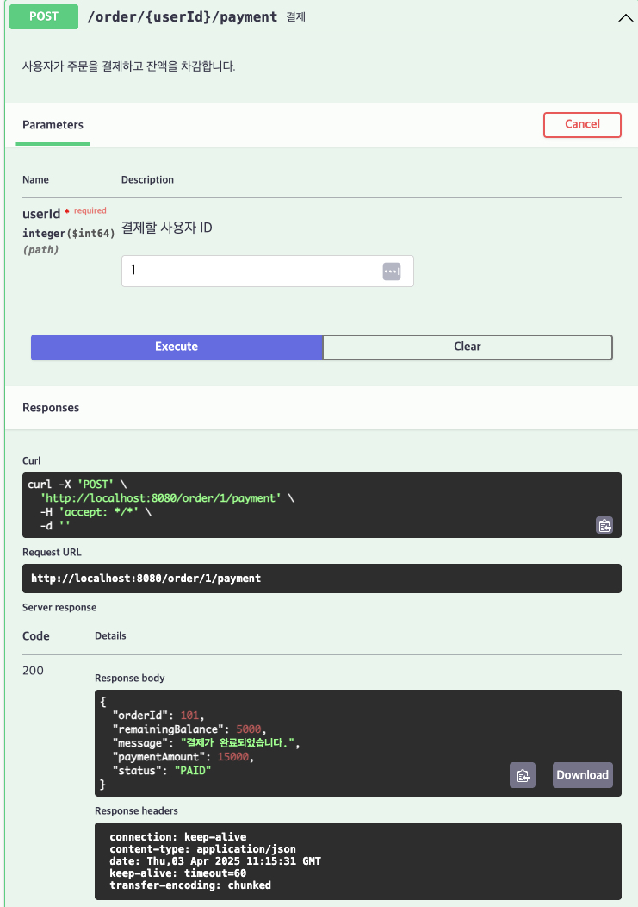

# [POST] /order/{userId}/payment

## 설명
사용자가 주문을 결제하고 잔액을 차감합니다.

## Path Variable

| 이름     | 타입   | 설명         |
|----------|--------|--------------|
| userId   | Long   | 결제할 사용자 ID |

## Request Body
```
{
"orderId": 101,
"paymentAmount": 15000
}
```
| 필드명        | 타입    | 설명                         |
|---------------|---------|------------------------------|
| orderId       | Long    | 결제할 주문의 고유 ID         |
| paymentAmount | Integer | 결제 금액                     |

## Response Body
```
{
"message": "결제가 완료되었습니다.",
"orderId": 101,
"status": "PAID",
"paymentAmount": 15000,
"remainingBalance": 5000
}
```
| 필드명        | 타입    | 설명                         |
|---------------|---------|------------------------------|
| message       | String  | 결제 처리 결과 메시지         |
| orderId       | Long    | 결제된 주문 고유 ID           |
| status        | String  | 결제 상태 (PAID)              |
| totalAmount   | Integer | 결제된 금액                   |
| remainingBalance | Integer | 결제 후 남은 잔액              |

## Swagger UI



[돌아가기](../../README.md)