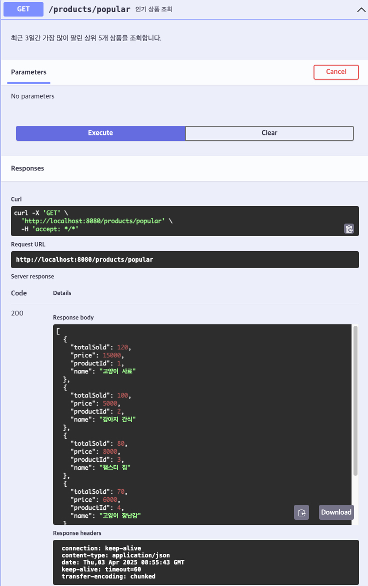

# [GET] /products/popular

## 설명
최근 3일간 가장 많이 팔린 상위 5개 상품을 조회합니다.

## Response Body
```
[
{
"productId": 1,
"name": "고양이 사료",
"price": 15000,
"totalSold": 120
},
{
"productId": 2,
"name": "강아지 간식",
"price": 5000,
"totalSold": 100
},
{
"productId": 3,
"name": "햄스터 집",
"price": 8000,
"totalSold": 80
},
{
"productId": 4,
"name": "고양이 장난감",
"price": 6000,
"totalSold": 70
},
{
"productId": 5,
"name": "강아지 침대",
"price": 25000,
"totalSold": 60
}
]
```
## Swagger UI



[돌아가기](../../README.md)