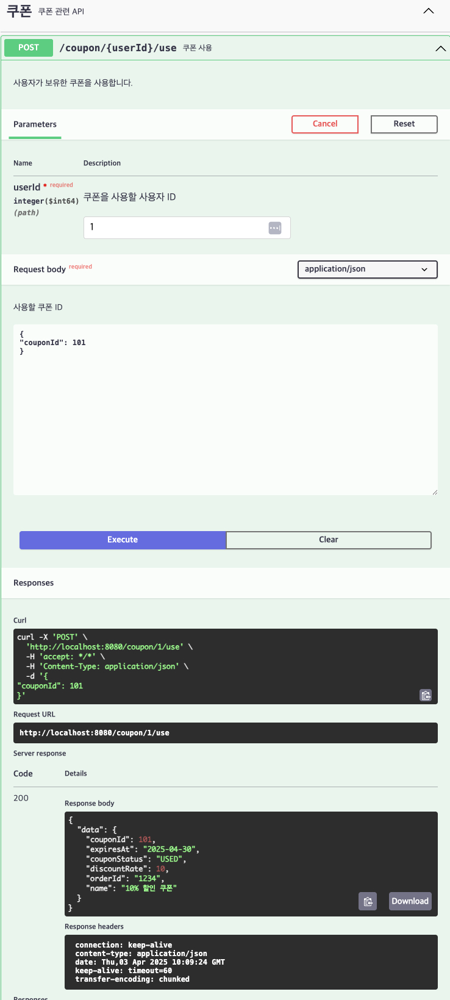

# [POST] /coupon/{userId}/use

## 설명
사용자가 보유한 쿠폰을 사용합니다.

## Path Variable

| 이름     | 타입   | 설명         |
|----------|--------|--------------|
| userId   | Long   | 사용자 ID    |

## Request Body
```
{
"couponId": 101
}
```
## Response Body
```
{
"data": {
    "couponId": 101,
    "orderId", "1234",
    "name": "10% 할인 쿠폰",
    "discountRate": 10,
    "expiresAt": "2025-04-30",
    "couponStatus": "USED"
  }
}
```
## Swagger UI



[돌아가기](../../README.md)